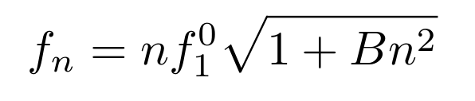
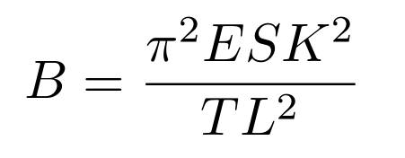
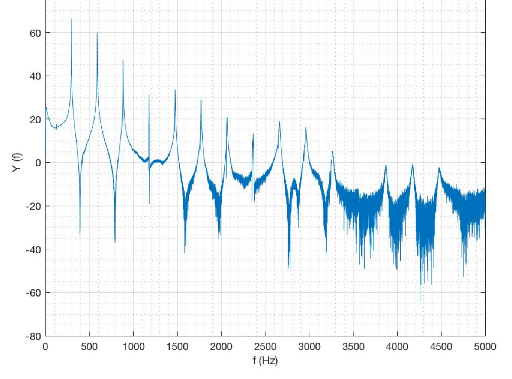
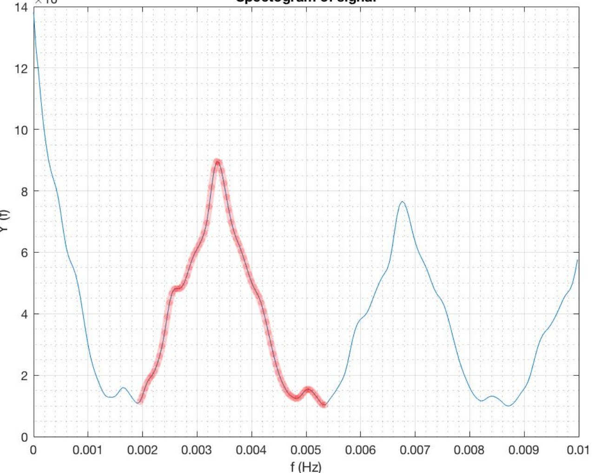
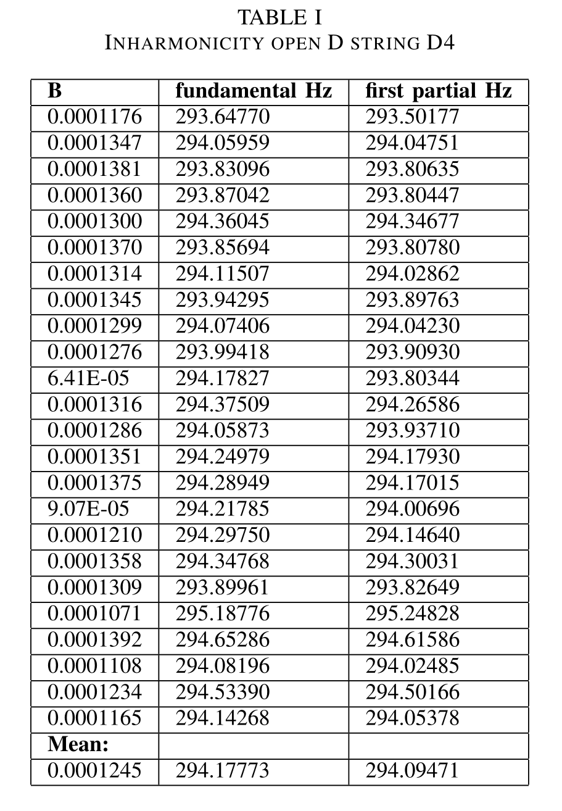
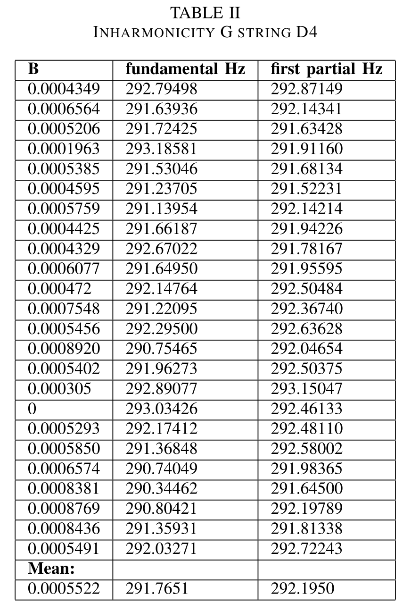

# Guessing the Fingerings
## Summary 
This repository contains the code of my Master semester project at [EPFL](https://www.epfl.ch).

### Abstract

Musicians can play in different ways in order to get the same note.
There are many reasons why the musician chooses to play a
note with a specific fingering. It could be because of a practical
reason, such as to facilitate the playing, or because of aesthetic
reasons such as aiming to have a certain timbre. To recognize
which string has been used is a difficult exercise, which only a
trained ear can achieve. Our aim was thus to propose a way to find some characteristic of a string within its sound, in order to recognize it when it has been used for playing any note.
The task was to continue the semester project of another student Raphaël Latty, [*Guessing the fingerings*](https://github.com/LCAV/fingerings) with the aim to improve its detection algorithm.
This project mainly focused on the violin, as it is the instrument used to record the samples on which the algorithm has been tested. But the algorithm should work for any instrument which pluck their strings and vary their length to produce sound.

### Summary
The inhamornicity model of the string used was the following:

  

where B is defined as:

  

We can see that if we multiply B by L^2, we get a constant result that can then characterize the string.

This is a MATLAB code which computes the estimated inharmonicity of a given
audio file. It uses simple DFTs and the [MUSIC](https://en.wikipedia.org/wiki/MUSIC_(algorithm)) algorithm.
The DFT is used to first approximate the partials location. As the sample size is not sufficient to get a good estimation of the partials, the algorithm then refines the peaks locations using the MUSIC pseudo-spectrum of the sample.

To find the partials location, the algorithm first do a power spectrum on the signal: 

  

We see that the partials have approximatively the same distance between each other. To evaluate this distance, we redo a power spectrum on this result, which gives us the following output:

  

The second peak highlighted in red contains the frequency information of the distance of the partials. We take its maximum and deduce then the approximate location of the partials. After that, the algorithm uses the MUSIC pseudo-spectrum evaluated on the sample as a way of refining the peak locations.

To use it run the test_inharmonicity.mlx with the desired file location in
the PATH variable. It will take all the .aif files in the given folder and stack
their inharmonicity in the Bs variable.

## Some results

We recorded multiple samples of pizzicato D4 with a violin.
Firstly using the open D string and  secondly using the 4th position on the G string.
As the two strings have different stiffnesses, masses etc, we can see that the B coefficient is different for both strings. Note that in these results, B is not multiplied by L^2 to get a constant result.

  

  

